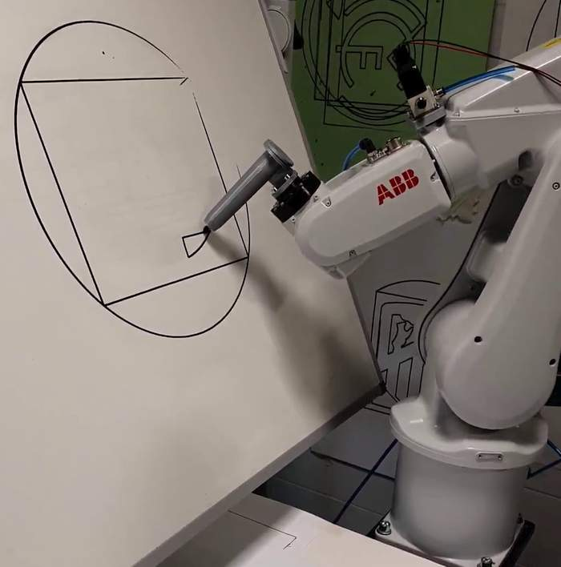
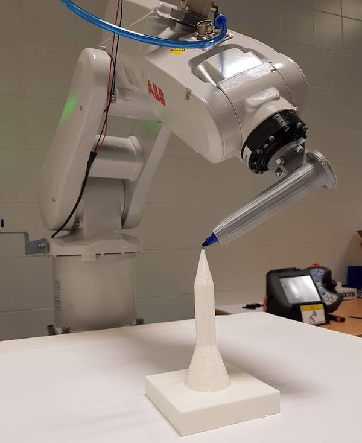
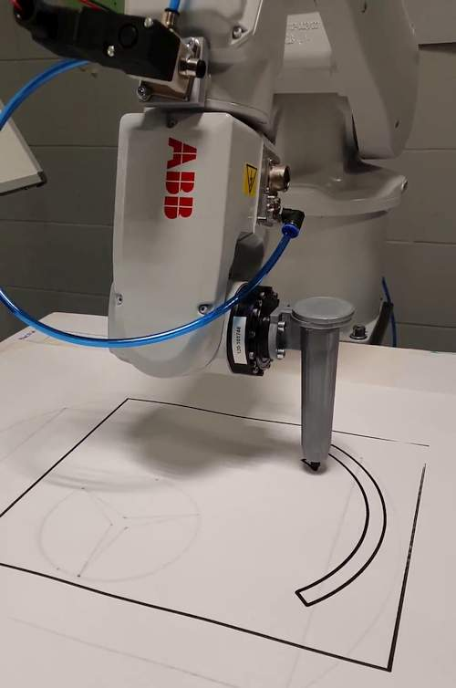
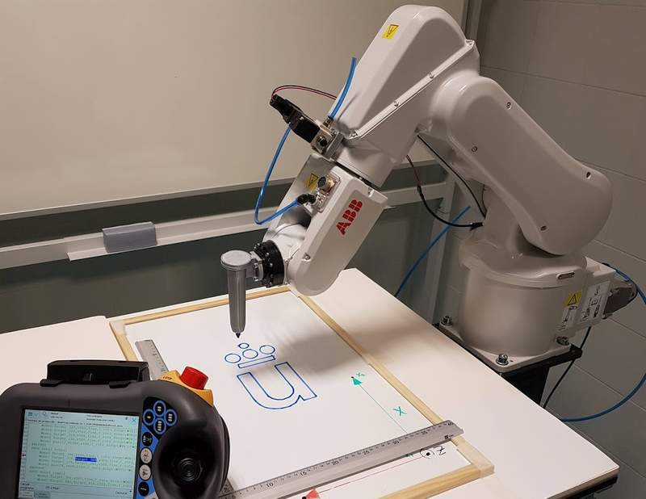

# Parametric maker holder for ABB IRB 120 robot

This maker holder is attached to the robot flange and allows the robot to paint with a cheap tool.

The design is modeled using Python for FreeCAD; thus, different variations of the tool can be 3D printed, with different sizes. This is useful for teaching, since it allows each student to have a slightly different tool; therefore, each student has to develop its own robot programming.

If the tool is broken, it can be 3D printed it again with very little cost.

It has two parts that have to be printed separately: the holder and its lid

## License 

Hardware License: CERN 2 (https://ohwr.org/cernohl)

Software License: [LGPL 3.0](./License.md)

Documentation License: CC BY 4.0 (https://creativecommons.org/licenses/by/4.0/)

## Project organization:
* __python__: python source code describing the tool. Since it is described in Python it is parametric. It has to be run in FreeCAD. More information on how to do this:
  
   https://github.com/felipe-m/freecad_filter_stage
   
   https://dx.doi.org/10.1371%2Fjournal.pone.0225795
   
* __freecad__: resulting FreeCAD models. They can be modified using FreeCAD
* __stl__: STL models to be 3D printed
* __step__: standard CAD files that can be edited in other CAD tools
* __python/comps__: Some python libraries which are needed for the Python code. https://github.com/felipe-m/fcad-comps

## Pictures

